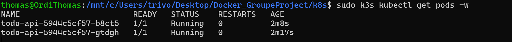

# Todo API - Pipeline CI/CD (projet groupe)

## Membres
- Rania Zeramdini
- Thomas Rivoire
- Nolan Lefebvre
## Image DockerHub
`thomasr10/todo-api`
## Déploiement
- Déploiement Kubernetes montrant les pods de l’application todo-api en cours d’exécution. 

Voir DEPLOYMENT.md
## Dashboard Grafana
<!-- coller le screenshot ici en phase 5 -->
